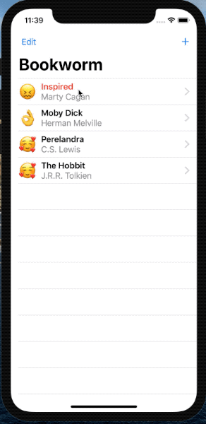

# Bookly
*Built using: SwiftUI, Core Data*



Project 11 (days 53-56) of the #100DaysOfSwiftUI challenge: https://www.hackingwithswift.com/100/swiftui/53

### @Binding for building custom reusable views
Extract a view and move it to a separate file - use @Binding in the new view, and pass the $variable.

For the preview to work you can pass the .constant modifier:

```Swift
struct RatingView_Previews: PreviewProvider {
    static var previews: some View {
        RatingView(rating: .constant(5))
    }
} 
```

This is also useful in the DetailView where we want to use the same view to display the rating of the book, however not have it be "updatable":

```Swift
RatingView(rating: .constant(Int(self.book.rating)))
                    .font(.largeTitle) 
```

We can modify the size of the stars using the .font modifier because we are using SF Symbols.

### CoreData

1. Create a new entity with attributes in the .xcdatamodeld file
2. Declare a @FetcuhRequest variable, with or without providing sortDescriptors:

```Swift
@FetchRequest(entity: Book.entity(), sortDescriptors: [
        NSSortDescriptor(keyPath: \Book.title, ascending: true),
        NSSortDescriptor(keyPath: \Book.author, ascending: true)
    ]) var books: FetchedResults<Book> 
```
3. Display the data in a List:
```Swift
ForEach(books, id: \.self) { book in 
```
4. To delete data, declare a Managed Object Context (this is provided by Core Data automatically):
```Swift
@Environment(\.managedObjectContext) var moc 
```
5. Add the onDelete modifer on the ForEach view (not the List):
```Swift
.onDelete(perform: deleteBooks) 
```
6. Implement the deleteBooks(at offsets:) method:
```Swift
func deleteBooks(at offsets: IndexSet) {
        for offset in offsets {
            // find this book in our fetch request
            let book = books[offset]

            // delete it from the context
            moc.delete(book)
        }

        // save the context
        try? moc.save()
    } 
```
### Passing the Managed Object Context to a sheet
Sheets won't get the @Environment variables of their 'parents', as happens for child views of NavigationViews for example.
So we have to pass the moc manually:
```Swift
.sheet(isPresented: $showingAddScreen) {
    AddBookView().environment(\.managedObjectContext, self.moc)
} 
```
### Closing a NavigationLink view programmatically
It's identical to closing a sheet, first define the presentationMode:
```Swift
@Environment(\.presentationMode) var presentationMode 
```
And call .dismiss()
```Swift
presentationMode.wrappedValue.dismiss() 
```


